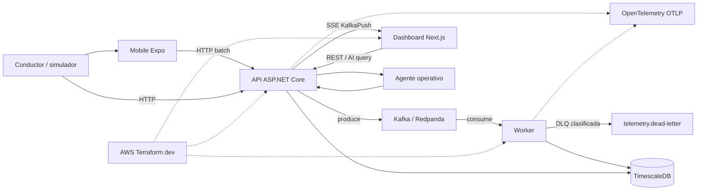
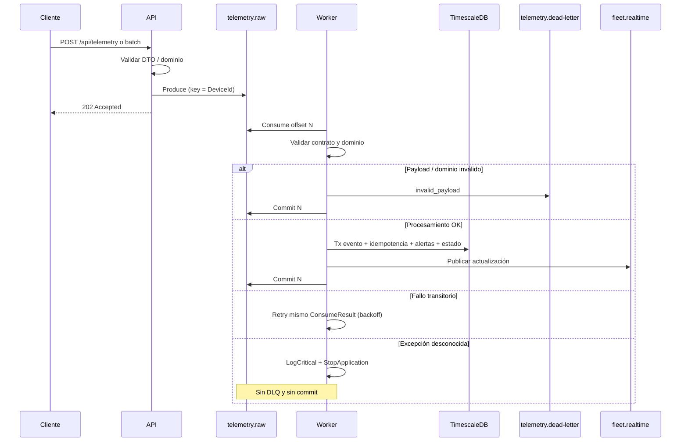
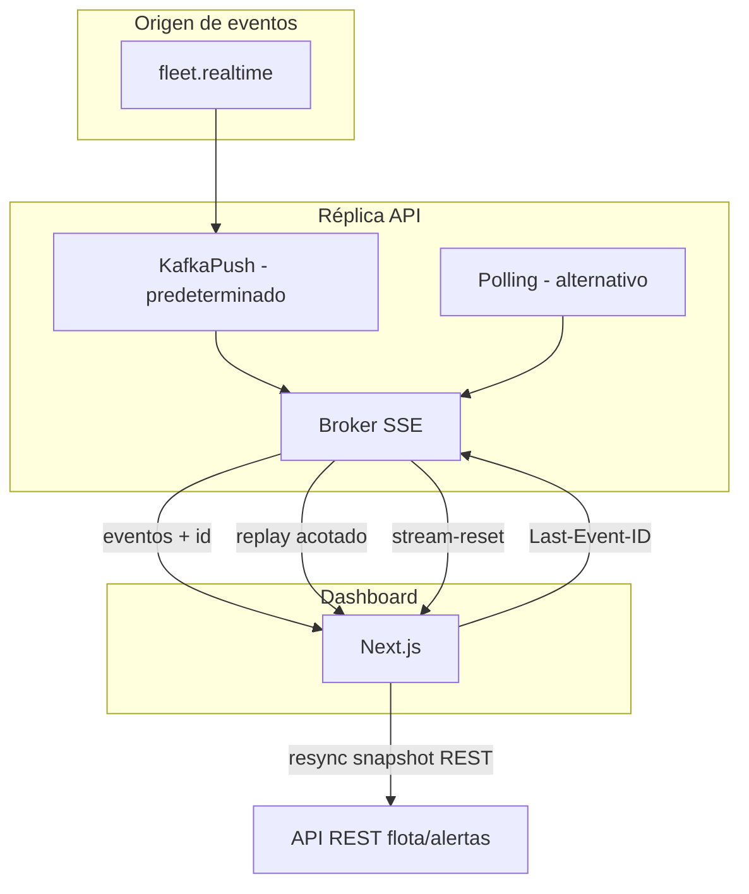
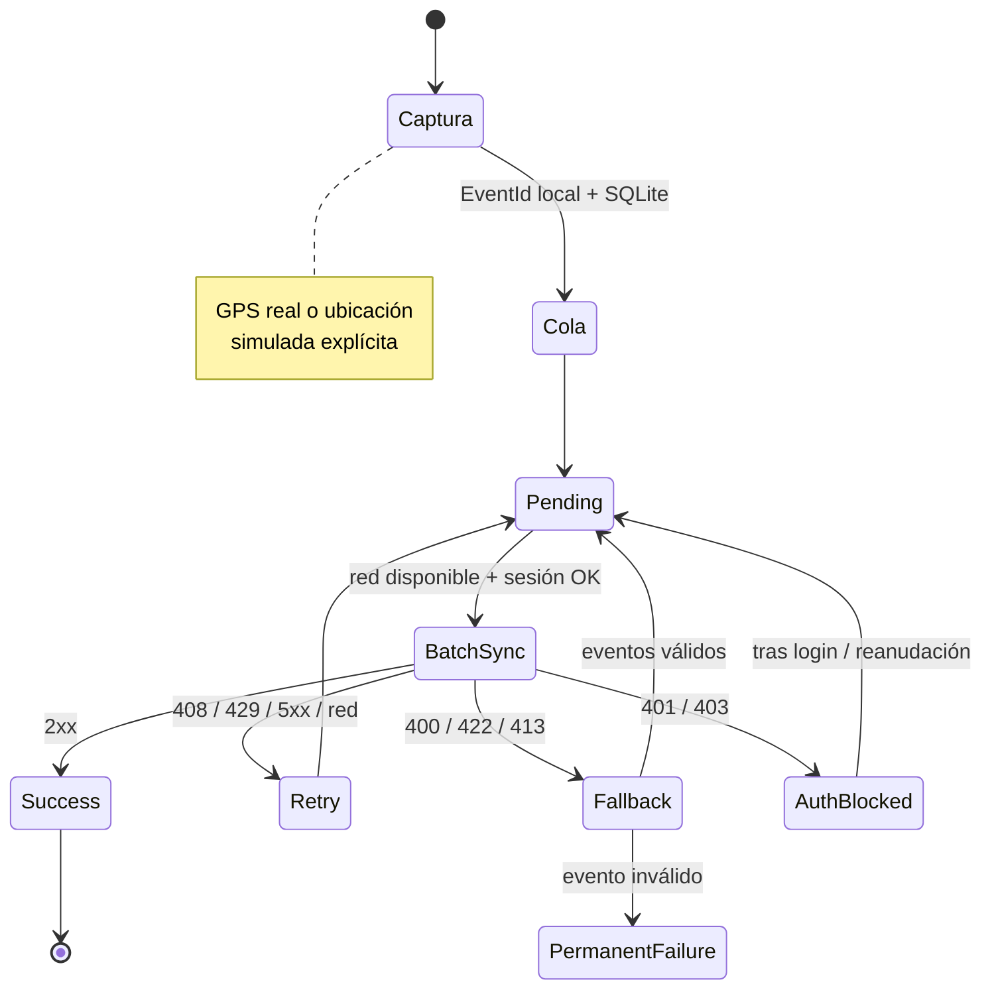
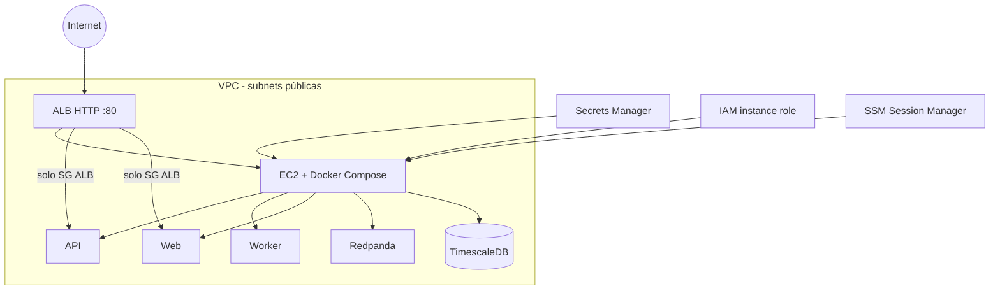
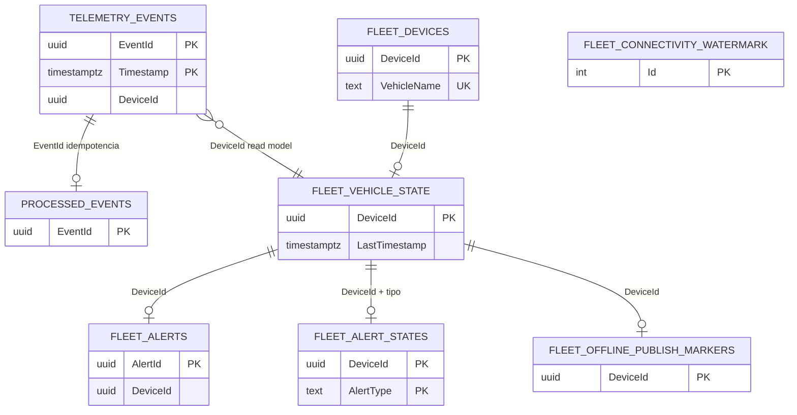

<div align="center">

# Fleet Telemetry Platform

**Plataforma event-driven para monitoreo de flotas, telemetría en tiempo real, operación offline-first y análisis asistido por IA.**

[](https://github.com/AlejoLobo/fleet-telemetry-platform/actions/workflows/ci.yml)


[Inicio rápido](#inicio-rápido) ·
[Arquitectura](#arquitectura) ·
[API](#api) ·
[Pruebas](#estrategia-de-calidad) ·
[Infraestructura](#topología-aws-dev) ·
[Documentación](#documentación)

</div>

## Índice

- [Descripción general](#descripción-general)
- [Arquitectura](#arquitectura)
- [Stack tecnológico](#stack-tecnológico)
- [Inicio rápido](#inicio-rápido)
- [Flujo de demostración](#flujo-de-demostración)
- [API](#api)
- [Garantías técnicas](#garantías-técnicas)
- [Seguridad y resiliencia](#seguridad-y-resiliencia)
- [Observabilidad](#observabilidad)
- [Estrategia de calidad](#estrategia-de-calidad)
- [Estructura del repositorio](#estructura-del-repositorio)
- [Documentación](#documentación)
- [Production readiness](#production-readiness)
- [Decisiones arquitectónicas críticas](#decisiones-arquitectónicas-críticas)
- [Estado del proyecto](#estado-del-proyecto)
- [Convenciones de contribución](#convenciones-de-contribución)
- [Autor](#autor)

---

## Descripción general

Plataforma de monitoreo de flotas que ingesta telemetría, la procesa de forma asíncrona y la expone en tiempo real a operadores y a un agente de consulta operativa.

### Problema

Operar una flota requiere correlacionar posición, velocidad y estado de vehículos con alertas accionables, incluso cuando los conductores pierden conectividad. Una API síncrona acoplada a la persistencia no escala ni aísla fallos; hace falta un pipeline event-driven con garantías explícitas de entrega, idempotencia y recuperación.

### Solución

Los productores (app móvil Expo u otros clientes HTTP) envían telemetría a la API ASP.NET Core. La API valida y publica en Kafka/Redpanda (`telemetry.raw`, respuesta `202`). Un Worker consume con semántica **at-least-once**, persiste en TimescaleDB, genera alertas y actualiza el read model. El dashboard Next.js consulta REST y recibe eventos por SSE (**KafkaPush** por defecto). El móvil conserva una cola SQLite offline-first. Un agente operativo responde preguntas de flota mediante herramientas internas controladas.

### Capacidades principales

| Capacidad | Implementación | Garantía / característica |
|-----------|----------------|---------------------------|
| Ingesta HTTP | `POST /api/telemetry` y batch | Validación de dominio + `202` sin bloquear por persistencia |
| Mensajería | Kafka vía Redpanda local | Topic `telemetry.raw`, key `DeviceId` |
| Procesamiento | Worker .NET | At-least-once, mismo offset hasta resultado terminal |
| Persistencia | TimescaleDB hypertable | Idempotencia por `EventId` (`processed_events`) |
| Identidad | `DeviceId` UUID + `VehicleName` | Nombre editable; renombrar no cambia partición ni historial |
| Alertas | Evaluador + cooldown | Deduplicación de condiciones activas |
| Tiempo real | SSE KafkaPush | `Last-Event-ID`, replay, `stream-reset`, resync |
| Dashboard | Next.js 15 + React 19 | Modo API y mock; Vitest en CI |
| Mobile offline | Expo 54 + SQLite | Batch sync, fallback, reanudación post-login |
| Agente IA | `POST /api/ai/query` | Catálogo tipado de tools; OpenAI opcional |
| Observabilidad | OpenTelemetry | Opt-in OTLP (trazas, métricas, logs) |
| AWS dev | Terraform + EC2 + Compose | Entorno reproducible; no HA productivo |
| Calidad | GitHub Actions | Backend, Web, Mobile, Infra, Docker, E2E, docs |

---

## Arquitectura

### Contexto del sistema



### Flujo de procesamiento de telemetría

Semántica: **at-least-once** con commit manual. No es exactly-once end-to-end.



### Flujo en tiempo real SSE



KafkaPush es el modo predeterminado. El fan-out multi-réplica, el replay y el resync tienen límites documentados en [`docs/realtime-sse.md`](docs/realtime-sse.md); no se afirma una garantía de entrega global más allá de ese contrato.

### Sincronización Mobile offline-first



### Topología AWS dev

Entorno de **desarrollo/demostración**, no producción con alta disponibilidad.



Sin SSH público; puertos 5432 / 19092 sin exposición pública; 3000 / 5000 solo desde el security group del ALB. Detalle: [`infra/terraform/dev/README.md`](infra/terraform/dev/README.md).

### Modelo de datos simplificado

Las relaciones son lógicas por `DeviceId` / `EventId`. El nombre visible (`VehicleName`) vive en `fleet_devices` y **no** redefine identidad. El esquema TimescaleDB **no** declara foreign keys físicas entre estas tablas.



---

## Stack tecnológico

Versiones tomadas de los manifests del monorepo.

| Capa | Tecnología | Versión / nota |
|------|------------|----------------|
| Backend | ASP.NET Core / Worker | `net10.0` |
| Mensajería | Redpanda (Kafka API) | imagen `v24.2.4` |
| Persistencia | TimescaleDB | `2.17.2-pg16` |
| Web | Next.js + React | Next `^15.1.0`, React `^19.0.0` |
| Mobile | Expo + React Native | Expo `~54.0.0`, RN `0.81.5` |
| Infraestructura | Docker Compose + Terraform | Terraform `>= 1.9.8` (CI `1.9.8`) |
| Observabilidad | OpenTelemetry OTLP | Opt-in vía configuración |
| Calidad | xUnit, Vitest, Jest, k6, GitHub Actions | Ver [`docs/testing.md`](docs/testing.md) |

---

## Inicio rápido

### Requisitos

- Docker Desktop o Docker Engine con Compose
- Git
- PowerShell o Bash (smoke tests)

No se requiere .NET ni Node en el host si se usa el stack contenedorizado completo.

### Clonar

```bash
git clone https://github.com/AlejoLobo/fleet-telemetry-platform.git
cd fleet-telemetry-platform
```

### Configurar variables

```bash
cp .env.example .env
```

Ajustar solo lo necesario para el entorno local. No versionar secretos reales. Valores de demo (Auth, TimescaleDB) están documentados en `.env.example`.

### Levantar el stack

```bash
docker compose --profile app up -d --build
```

### Verificar estado

```bash
docker compose ps
curl -fsS http://localhost:5000/health/live
curl -fsS http://localhost:5000/health/ready
```

### Ejecutar smoke test

```bash
./scripts/smoke-test.ps1          # Windows
bash scripts/smoke-test.sh        # Bash
```

### Detener

```bash
docker compose --profile app down
```

### Servicios locales

| Servicio | URL / endpoint |
|----------|----------------|
| Dashboard | http://localhost:3000 |
| API | http://localhost:5000 |
| Kafka (externo) | `localhost:19092` |
| TimescaleDB | `localhost:5432` (user/pass/db: `fleet`) |

Guía ampliada: [`docs/getting-started.md`](docs/getting-started.md).

---

## Flujo de demostración

1. Levantar el stack con `docker compose --profile app up -d --build`.
2. Comprobar `/health/ready`.
3. Enviar telemetría (`POST /api/telemetry`).
4. Verificar que el Worker procesó (estado de flota / filas en TimescaleDB).
5. Abrir el dashboard en http://localhost:3000.
6. Observar actualización por SSE (KafkaPush).
7. Consultar o generar una alerta operativa.
8. Consultar el agente (`POST /api/ai/query`).
9. Ejecutar el smoke test E2E.

Procedimiento completo de sustentación: [`docs/demo-sustentacion.md`](docs/demo-sustentacion.md).

---

## API

| Método | Ruta | Descripción |
|--------|------|-------------|
| `GET` | `/health/live` | Liveness |
| `GET` | `/health/ready` | Readiness (DB + Kafka) |
| `GET` | `/api/ops/summary` | Resumen operativo |
| `POST` | `/api/telemetry` | Ingesta → Kafka (`202`) |
| `POST` | `/api/telemetry/batch` | Ingesta batch |
| `POST` | `/api/devices/register` | Registro DeviceId; asigna `vehicleName` |
| `PATCH` | `/api/devices/{deviceId}/name` | Renombrar sin cambiar identidad |
| `GET` | `/api/fleet` | Estado de flota (cursor) |
| `GET` | `/api/alerts` | Alertas abiertas |
| `GET` | `/api/events/stream` | SSE |
| `POST` | `/api/ai/query` | Agente operativo |

### Ingestar telemetría

```bash
curl -X POST http://localhost:5000/api/telemetry \
  -H "Content-Type: application/json" \
  -H "X-Device-Id: 11111111-1111-1111-1111-111111111111" \
  -d '{
    "eventId": "22222222-2222-2222-2222-222222222222",
    "deviceId": "11111111-1111-1111-1111-111111111111",
    "driverId": "DRV-001",
    "timestamp": "2026-07-08T22:00:00Z",
    "latitude": 4.6533,
    "longitude": -74.0836,
    "speedKmh": 130.0,
    "fuelLevelPercent": 10.0,
    "batteryPercent": 95.0
  }'
```

### Consultar el agente

```bash
curl -X POST http://localhost:5000/api/ai/query \
  -H "Content-Type: application/json" \
  -d '{"question": "¿Qué vehículos tienen alertas críticas?"}'
```

Si `Auth__Enabled=true`, los endpoints protegidos requieren JWT (`Authorization: Bearer …`). Con el valor por defecto del ejemplo (`false`) la consulta funciona sin token.

Referencia completa: [`docs/api-and-ops.md`](docs/api-and-ops.md).

---

## Garantías técnicas

### Procesamiento Kafka

- Semántica **at-least-once** (no exactly-once E2E)
- Commit manual del offset
- Reintento del **mismo** `ConsumeResult` hasta resultado terminal
- DLQ solo para fallos de datos/contrato clasificados
- Excepción desconocida: sin DLQ, sin commit, detención del host

### Idempotencia y persistencia

- Marca en `processed_events` por `EventId`
- Persistencia transaccional con el procesamiento
- Read model `fleet_vehicle_state`
- Deduplicación / cooldown de alertas (`fleet_alert_states`)

### Realtime

- **KafkaPush** predeterminado; **Polling** alternativo
- `Last-Event-ID`, replay acotado, `stream-reset`
- Resync del cliente vía snapshot REST

### Mobile

- Cola SQLite con `EventId` estable generado en cliente
- Sync batch, retries y fallback parcial
- Bloqueo / reanudación según auth (401/403)
- Ubicación simulada solo de forma explícita

Detalle Worker/DLQ: [`docs/worker-and-dlq.md`](docs/worker-and-dlq.md).

---

## Seguridad y resiliencia

- JWT opcional (`Auth__Enabled`) con políticas de autorización
- CORS y rate limiting configurables
- Circuit breakers (Polly) en Kafka, DB y OpenAI
- Health checks (`/health/live`, `/health/ready`, circuit breakers)
- En AWS **dev**: Secrets Manager, IAM role, SSM; **sin** SSH público
- TimescaleDB y Kafka internos no expuestos a Internet en el stack Terraform dev

---

## Observabilidad

- OpenTelemetry **opt-in** (`OpenTelemetry:Enabled`)
- Export OTLP: trazas, métricas y logs
- Compose **no** incluye collector, Grafana, Tempo ni Prometheus

---

## Estrategia de calidad

| Área | Herramienta | Rol |
|------|-------------|-----|
| Application | xUnit | Validadores, alertas, IA, ops |
| Worker | xUnit | Processor, backoff, coordinación DLQ |
| Integration | xUnit + Kafka/Timescale (CI / Testcontainers) | Offsets, DLQ, esquema, read model |
| Web | Vitest + Testing Library | Hooks, SSE, resync, paginación (`test:ci` + cobertura V8) |
| Mobile | Jest (`jest-expo`) | Auth, SQLite, sync, location (`test:ci` + cobertura) |
| Smoke | scripts bash/PowerShell | API → Kafka → Worker → DB + DLQ |
| Carga | k6 | Ingesta reducida en CI |
| Terraform | `fmt` + `validate` | Blueprint y `infra/terraform/dev` |
| Docker | build de imágenes | API, Worker, Web |
| Documentation | GitHub Actions | Decisiones arquitectónicas + consistencia docs |

Pipeline: [`.github/workflows/ci.yml`](.github/workflows/ci.yml) · Detalle: [`docs/testing.md`](docs/testing.md).

---

## Estructura del repositorio

```
fleet-telemetry-platform/
├── backend/                 # API, Worker, Domain, Application, Infrastructure, tests
├── web/                     # Dashboard Next.js
├── mobile/                  # Expo offline-first
├── infra/terraform/         # Blueprint + entorno AWS dev ejecutable
├── docs/                    # Documentación técnica
├── scripts/                 # Smoke tests
├── load-tests/              # k6
├── docker-compose.yml
└── .env.example
```

---

## Documentación

| Categoría | Documento |
|-----------|-----------|
| Índice | [`docs/README.md`](docs/README.md) |
| Arquitectura | [`docs/architecture.md`](docs/architecture.md) |
| Ejecución | [`docs/getting-started.md`](docs/getting-started.md), [`docs/dev-environment.md`](docs/dev-environment.md) |
| Backend / ops | [`docs/api-and-ops.md`](docs/api-and-ops.md), [`docs/worker-and-dlq.md`](docs/worker-and-dlq.md) |
| Realtime | [`docs/realtime-sse.md`](docs/realtime-sse.md) |
| Persistencia | [`docs/database-migrations.md`](docs/database-migrations.md), [`docs/timescaledb-operations.md`](docs/timescaledb-operations.md) |
| Kafka contract | [`docs/kafka-telemetry-contract.md`](docs/kafka-telemetry-contract.md) |
| Pruebas | [`docs/testing.md`](docs/testing.md) |
| Infraestructura | [`infra/README.md`](infra/README.md), [`infra/terraform/dev/README.md`](infra/terraform/dev/README.md) |
| Frontend / mobile | [`web/README.md`](web/README.md), [`mobile/README.md`](mobile/README.md) |
| Sustentación | [`docs/demo-sustentacion.md`](docs/demo-sustentacion.md) |
| Analytics | [`docs/analytics-druid-mock.md`](docs/analytics-druid-mock.md) |

---

## Production readiness

| Área | Estado actual | Evidencia | Limitación |
|------|---------------|-----------|------------|
| Ingesta → Kafka | Operativo en demo/CI | Smoke + integración | At-least-once; sin exactly-once E2E |
| Worker + DLQ | Operativo | Unit + integración | Consumo serial por partición |
| TimescaleDB | Operativo local/Compose | Hypertables + tests | Migraciones productivas aún limitadas |
| Dashboard | Operativo | Vitest + build | Hosting/TLS productivo pendiente |
| Mobile | Operativo | Jest + export | Sin tiendas; EAS manual |
| Agente IA | Operativo | Tools + mock | OpenAI opcional; Druid no desplegado |
| Seguridad | Parcial MVP | JWT opcional, CORS, rate limit | Auth completa / mTLS pendiente |
| Observabilidad | Opt-in | OTLP | Sin collector ni dashboards en Compose |
| AWS | Dev reproducible | Terraform `dev/` | Sin HA, TLS/WAF ni autoscaling productivo |
| CI/CD | Automatizado | GitHub Actions | Sin deploy automático |

### Limitaciones conscientes

- Kafka es **at-least-once**; no hay exactly-once end-to-end.
- AWS `infra/terraform/dev` es económico y reproducible; **no** es producción HA.
- Sin TLS/WAF/autoscaling gestionado en el stack Terraform del MVP.
- OpenTelemetry sin collector ni dashboards incluidos en Compose.
- Mobile sin publicación en tiendas.
- OpenAI opcional; Druid real no está desplegado (contrato mock/intercambiable).
- DDL automático acotado; ver [`docs/database-migrations.md`](docs/database-migrations.md).

---

## Decisiones arquitectónicas críticas

Esta sección documenta **anti-patrones descartados** durante el diseño del pipeline y el
**criterio técnico** con el que se corrigieron. **No** describe defectos actuales del código
en `develop`: cada caso ya tiene corrección fusionada, archivos concretos, pruebas y SHA
verificable.

<details>
<summary>Caso 1 — reintento Kafka sin reutilizar el mismo offset</summary>

### Caso 1: reintento Kafka sin reutilizar el mismo offset

- **Enfoque incorrecto:** Tras un `RetryWithoutCommit`, no confirmar el offset, hacer
  `Task.Delay` y volver a llamar a `Consume()` para obtener un mensaje nuevo, en lugar de
  seguir trabajando el mismo `ConsumeResult`.
- **Riesgo:** No hacer commit **no** reposiciona automáticamente el cursor local del
  consumidor. Se puede procesar el mensaje N+1 antes de resolver N; si luego se confirma un
  offset posterior, se produce **pérdida silenciosa** de N. Eso viola la semántica
  **at-least-once** esperada en el Worker.
- **Criterio aplicado y corrección:** Conservar el mismo `ConsumeResult` y **no** llamar de
  nuevo a `Consume()` hasta un resultado terminal. Aplicar backoff configurable
  (`RetryInitialDelayMilliseconds` / `RetryMaxDelayMilliseconds`) sobre el mismo offset.
  Confirmar únicamente tras éxito, duplicado o DLQ publicada correctamente.
- **Archivos:**
  `backend/FleetTelemetry.Worker/TelemetryConsumerWorker.cs`,
  `backend/FleetTelemetry.Worker/TelemetryMessageProcessor.cs`,
  `backend/FleetTelemetry.Worker/KafkaProcessingRetryBackoff.cs`,
  `backend/FleetTelemetry.Infrastructure/Configuration/KafkaOptions.cs`,
  `backend/FleetTelemetry.Infrastructure/Configuration/ConfigurationValidator.cs`,
  `backend/FleetTelemetry.Worker/appsettings.json`,
  `.env.example`
- **Pruebas:**
  `backend/FleetTelemetry.Worker.Tests/KafkaProcessingRetryBackoffTests.cs`,
  `TelemetryMessageProcessorTests.Transient_db_error_sigue_reintentando`,
  integración
  `TelemetryConsumerWorkerIntegrationTests.Failed_first_offset_is_retried_before_second_offset_is_processed`
  (el primer offset falla y se procesa antes que el segundo)
- **Commit:** `e557210ad9aa526d622ba678fe4ec9464487d253` —
  `fix(worker): garantizar at-least-once reintentando el mismo offset`

</details>

<details>
<summary>Caso 2 — excepciones desconocidas enviadas a DLQ</summary>

### Caso 2: excepciones desconocidas enviadas a DLQ

- **Enfoque incorrecto:** Capturar cualquier `Exception` restante, publicarla en DLQ como
  `processing_failure` y confirmar el offset, tratando `NullReferenceException`, errores de
  mapping o defectos de programación como problemas permanentes del mensaje.
- **Riesgo:** Ocultar errores sistémicos, confirmar el offset y perder la oportunidad de
  reprocesar tras corregir el software. Convierte un defecto de código en un falso problema
  de datos.
- **Criterio aplicado y corrección:** Taxonomía explícita en el Worker: datos o contrato
  inválido → DLQ; fallo transitorio reconocido → retry sin commit; excepción desconocida →
  `LogCritical`, `StopApplication`, **sin** DLQ y **sin** commit.
- **Archivos:**
  `backend/FleetTelemetry.Worker/TelemetryMessageCoordinator.cs`,
  `backend/FleetTelemetry.Worker/TelemetryMessageProcessor.cs`,
  `docs/worker-and-dlq.md`
- **Pruebas:**
  `TelemetryMessageCoordinatorTests.Excepcion_inesperada_detiene_worker_sin_commit`
  (no publica DLQ, no confirma offset, solicita detener el Worker),
  `TelemetryMessageCoordinatorTests.Excepcion_inesperada_no_se_reintenta`,
  `TelemetryMessageProcessorTests.Excepcion_inesperada_se_propaga_sin_crear_DLQ`,
  integración
  `TelemetryConsumerWorkerIntegrationTests.Unexpected_error_stops_without_dlq_or_commit`
- **Commit:** `fc5f37368769f15026bd68bac366583958199f4c` —
  `fix(worker): detener procesamiento ante errores inesperados`
  (merge relacionado: `4cbb8bdcfa17ff09a674fce9235a9d7895c4fbe2`)

</details>

<details>
<summary>Caso 3 — Terraform aparentaba ser desplegable</summary>

### Caso 3: Terraform aparentaba ser desplegable

- **Enfoque incorrecto:** Presentar RDS PostgreSQL estándar, task definitions incompletas y
  placeholders `REPLACE_WITH_` como ruta desplegable de TimescaleDB/Kafka, describiendo
  definiciones sin services ni ALB como si fueran un despliegue funcional.
- **Riesgo:** Infraestructura engañosa: un `terraform apply` del blueprint no entrega un
  stack end-to-end; no hay TimescaleDB real ni una ruta reproducible de ejecución del MVP.
- **Criterio aplicado y corrección:** Conservar el blueprint conceptual claramente separado;
  agregar entorno **dev** ejecutable en `infra/terraform/dev/` (VPC, EC2 + Docker Compose,
  Redpanda, TimescaleDB, API, Worker, Web, ALB, Secrets Manager, IAM y SSM). Eliminar
  `REPLACE_WITH_` y las task definitions incompletas del árbol desplegable.
- **Archivos:**
  `infra/terraform/dev/` (`network.tf`, `alb.tf`, `compute.tf`, `security.tf`, `secrets.tf`,
  `variables.tf`, `user-data.sh.tftpl`, `terraform.tfvars.example`, `README.md`),
  `infra/README.md`,
  `docker-compose.yml`,
  `.github/workflows/ci.yml` (job Infra validation: `terraform fmt`/`validate` y rechazo de
  placeholders/secretos)
- **Pruebas:** Validación local y CI de Terraform (`fmt -check`, `init -backend=false`,
  `validate` en blueprint y `dev`); `git grep "REPLACE_WITH_"` vacío en `infra/terraform`;
  `docker compose config --quiet`. Run aprobado:
  https://github.com/AlejoLobo/fleet-telemetry-platform/actions/runs/29363945100
- **Commit:** `ba74a436f9c8a9d6bc9bda55eae970a554e4b850` —
  `fix(infra): añadir entorno dev reproducible en AWS`
  (merge en `develop`: `949be8e3086e35bbbaab52f9b3cbcaf2f7a5dd12`)

</details>

---

## Estado del proyecto

El repositorio constituye un **MVP técnico completo**: vertical de telemetría (ingesta → Kafka → Worker → TimescaleDB → dashboard/SSE/mobile/agente) ejecutable en local y con entorno AWS **dev** documentado. Las limitaciones productivas (HA, TLS, exactly-once, tiendas, collector OTEL, Druid real) están declaradas de forma explícita; no se presentan como capacidades desplegadas.

---

## Convenciones de contribución

Mensajes de commit en **español**, Conventional Commits:

```
tipo(alcance): descripción breve en imperativo
```

Ejemplos: `feat(worker): …`, `fix(ci): …`, `docs(readme): …`, `test(e2e): …`.

GitFlow práctico:

| Rama | Uso |
|------|-----|
| `main` | Estable |
| `develop` | Integración |
| `feature/*` | Funcionalidad |
| `fix/*` | Corrección |
| `docs/*` | Documentación |
| `test/*` | Pruebas / cobertura |
| `refactor/*` | Refactor |
| `chore/*` | Mantenimiento |

---

## Autor

Alejandro Lobo-Guerrero
