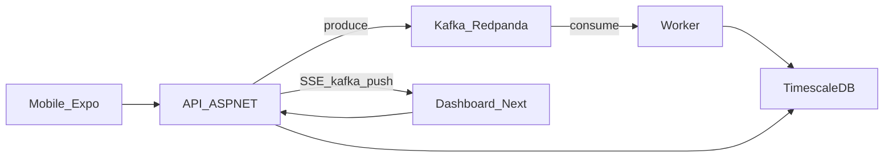

# Fleet Telemetry Platform

[](https://github.com/AlejoLobo/fleet-telemetry-platform/actions/workflows/ci.yml)

Plataforma de monitoreo de flotas con telemetría en tiempo real: ingesta HTTP, pipeline event-driven (Kafka), persistencia en TimescaleDB, dashboard Next.js, app móvil offline-first y agente IA operativo.

## Resumen

Conductores (mobile) o simuladores envían telemetría → la API publica en Kafka → el Worker persiste en TimescaleDB, genera alertas e idempotencia → el dashboard consume API/SSE. MVP vertical completo, defendible en demo y sustentación.

| Capa | Tecnología |
|------|------------|
| API / Worker | .NET 10, ASP.NET Core, Clean Architecture |
| Eventos | Kafka (Redpanda local) |
| Persistencia | TimescaleDB (PostgreSQL + hypertable) |
| Dashboard | Next.js 15 + React 19 |
| Mobile | Expo 52, SQLite offline-first |
| Infra | Docker Compose + Terraform blueprint AWS |

## Arquitectura



Flujo principal: `POST /api/telemetry` → `telemetry.raw` → Worker (`TelemetryMessageProcessor`) → `telemetry_events` / `fleet_alerts` / `processed_events`. Detalle en [docs/architecture.md](docs/architecture.md).

## Quickstart

```bash
# Stack completo (Redpanda + TimescaleDB + API + Worker + Web)
docker compose --profile app up -d --build

# Smoke test E2E (API → Kafka → Worker → DB + DLQ)
./scripts/smoke-test.ps1          # Windows
bash scripts/smoke-test.sh        # Bash
```

| Servicio | URL |
|----------|-----|
| API | http://localhost:5000 |
| Dashboard | http://localhost:3000 |
| Kafka (externo) | `localhost:19092` |
| TimescaleDB | `localhost:5432` (user/pass/db: `fleet`) |

Solo infra (API/Worker/Web en host): `docker compose up -d`. Guía completa: [docs/getting-started.md](docs/getting-started.md).

## Endpoints clave

| Método | Ruta | Descripción |
|--------|------|-------------|
| `GET` | `/health/live` | Liveness |
| `GET` | `/health/ready` | Readiness (DB + Kafka) |
| `GET` | `/api/ops/summary` | Resumen operativo |
| `POST` | `/api/telemetry` | Ingesta → Kafka (`202`) |
| `GET` | `/api/fleet` | Estado de flota (paginado por cursor) |
| `GET` | `/api/alerts` | Alertas abiertas |
| `GET` | `/api/events/stream` | SSE |
| `POST` | `/api/ai/query` | Agente IA |

Lista completa y ejemplos: [docs/api-and-ops.md](docs/api-and-ops.md).

Ver [docs/demo-sustentacion.md](docs/demo-sustentacion.md) para el guion de evaluación y checklist contra requerimientos.

## Documentación

| Guía | Contenido |
|------|-----------|
| [docs/README.md](docs/README.md) | Índice |
| [docs/demo-sustentacion.md](docs/demo-sustentacion.md) | Guion de demo y checklist |
| [docs/architecture.md](docs/architecture.md) | Clean Architecture, DI, flujo |
| [docs/getting-started.md](docs/getting-started.md) | Arranque local, env, caveats |
| [docs/api-and-ops.md](docs/api-and-ops.md) | Endpoints, auth, health/ops |
| [docs/worker-and-dlq.md](docs/worker-and-dlq.md) | Processor, validación, DLQ |
| [docs/testing.md](docs/testing.md) | Unitarios, integración, smoke, CI |
| [docs/database-migrations.md](docs/database-migrations.md) | DDL, `schema_versions`, EF migrations |
| [docs/realtime-sse.md](docs/realtime-sse.md) | SSE por polling (decisión MVP) |
| [infra/README.md](infra/README.md) | Terraform blueprint AWS |
| [web/README.md](web/README.md) / [mobile/README.md](mobile/README.md) | Frontend y app |

## Estructura del repositorio

```
fleet-telemetry-platform/
├── backend/
│   ├── FleetTelemetry.sln
│   ├── FleetTelemetry.Api/
│   ├── FleetTelemetry.Worker/
│   ├── FleetTelemetry.Domain/
│   ├── FleetTelemetry.Application/
│   ├── FleetTelemetry.Infrastructure/
│   ├── FleetTelemetry.Application.Tests/
│   ├── FleetTelemetry.Worker.Tests/
│   └── FleetTelemetry.Integration.Tests/
├── web/                 # Dashboard Next.js
├── mobile/              # Expo offline-first
├── scripts/             # smoke-test.ps1 / smoke-test.sh
├── load-tests/          # k6
├── infra/terraform/     # Blueprint AWS
├── docs/
├── docker-compose.yml
└── .env.example
```

## Diseño del consumidor Kafka

El Worker implementa at-least-once con commit manual, DLQ obligatoria y processor stateless:

- **Mismo offset hasta resultado terminal:** reintentos de negocio y backoff sobre el mismo `ConsumeResult`; el commit solo ocurre tras éxito, duplicado tratado o publicación DLQ exitosa.
- **Coordinación DLQ:** `TelemetryMessageCoordinator` separa procesamiento y publicación; los fallos de DLQ reintentan solo la publicación sin reprocesar el evento.
- **Payloads inválidos:** null, vacío o whitespace → DLQ `invalid_payload`, luego commit.

Detalle: [docs/worker-and-dlq.md](docs/worker-and-dlq.md) · Pruebas: `FleetTelemetry.Worker.Tests`, `FleetTelemetry.Integration.Tests`.

## Matriz de production readiness

| Área | Implementado y probado | Limitación consciente | Blueprint / mock | Pendiente |
|------|------------------------|----------------------|------------------|-----------|
| Ingesta HTTP → Kafka | Sí (smoke + integración) | At-least-once, sin exactly-once E2E | — | Rate limit por API key |
| Worker + DLQ | Sí (unit + integración) | Consumo serial por partición | — | Parallel consumer tuning |
| TimescaleDB local | Sí (Docker Compose + tests) | DDL auto solo Development | RDS PG16 sin Timescale | Timescale Cloud en AWS |
| Dashboard Next.js | Sí (build + mock mode) | SSE por polling DB | — | Hosting productivo |
| Mobile offline | Sí (typecheck + SQLite) | Sin tiendas / EAS manual | — | Sync conflict resolution |
| Agente IA | Sí (tools + mock) | OpenAI opcional | Druid mock (`IAnalyticsQueryService`) | Druid real |
| Seguridad API | Sí (JWT opcional, rate limit, CORS) | Auth parcial en MVP | — | OAuth2 / mTLS |
| Observabilidad | Sí (OTLP opt-in, métricas básicas) | Sin collector en Compose | — | Dashboards Grafana/Tempo |
| CI/CD | Sí (develop + main, fmt/validate) | Sin deploy automático | Terraform blueprint | MSK, ALB, ECS services |
| Migraciones DB | Sí (`schema_versions`, guard prod) | EF migrations no generadas aún | `docs/database-migrations.md` | Pipeline SQL versionado |

Detalle de limitaciones históricas: sección siguiente y [docs/demo-sustentacion.md](docs/demo-sustentacion.md).

## Limitaciones MVP (conscientes)

- Terraform es **blueprint** (RDS = PostgreSQL estándar, sin MSK, ALB completo, tasks productivas ni deploy del dashboard). Persistencia Timescale en AWS: **Timescale Cloud o self-hosted**. Ver [infra/README.md](infra/README.md).
- Analytics Druid: **no desplegado**; solo contrato `IAnalyticsQueryService` con implementación Timescale. Ver [docs/analytics-druid-mock.md](docs/analytics-druid-mock.md).
- SSE **KafkaPush** por defecto (`vehicle-update` canónico). Fan-out multi-réplica, offset Kafka como ID SSE, `Last-Event-ID` y `stream-reset`. Ver [docs/realtime-sse.md](docs/realtime-sse.md).
- JWT opcional y parcial; OpenAI opcional (pulido de texto).
- Preview mobile EAS manual (`mobile-preview.yml`), sin tiendas.
- OpenTelemetry **opt-in** vía `OpenTelemetry:Enabled` y endpoint OTLP configurable.
- DDL automático **deshabilitado en producción**; ver [docs/database-migrations.md](docs/database-migrations.md).
- Worker serial: un mensaje bloqueado puede detener particiones asignadas a la instancia.
- Kafka es **at-least-once**, no exactly-once end-to-end.

## Commits

Mensajes en **español**, conventional commits:

```
tipo(alcance): descripción breve en imperativo
```

Ejemplos: `feat(worker): ...`, `fix(ci): ...`, `docs(readme): ...`, `test(e2e): ...`.

## AI Audit

Registro de propuestas incorrectas de IA durante el desarrollo, la corrección aplicada y la verificación asociada.

| Caso | Problema / propuesta incorrecta | Riesgo | Decisión aplicada | Verificación | Estado |
|------|----------------------------------|--------|-------------------|--------------|--------|
| Persistencia desde controllers | Guardar telemetría directamente en TimescaleDB desde `TelemetryController` | Acopla ingesta con persistencia; rompe desacoplamiento Kafka | Ingesta publica en `telemetry.raw` y responde `202`; Worker persiste | Smoke test + integración Worker | **Implementado y probado** |
| Datasets completos al LLM | Enviar todos los eventos o tablas completas al modelo | Fuga de datos, costo y alucinaciones | Catálogo cerrado `AiToolCatalog` + `AiToolRouter`; `unsupported_query` sin LLM | `AiToolCatalogTests`, `AiToolRouterTests` | **Implementado y probado** |
| Dashboard sin backend | Depender solo del API real sin modo mock | Demo inutilizable sin stack levantado | `NEXT_PUBLIC_DATA_MODE=mock` en web | `npm run build` web | **Implementado y probado** |
| Simulación GPS silenciosa | Fabricar coordenadas cuando GPS falla sin marcar origen | Telemetría ficticia indistinguible en operaciones | `EXPO_PUBLIC_ALLOW_SIMULATED_LOCATION=true` explícito; `source` propagado; consultas excluyen `simulated` por defecto | `location-provider.test.ts`, consultas Timescale | **Implementado y probado** |
| SSE `_lastAlertCheck` | Cursor solo por timestamp pierde alertas concurrentes | Pérdida/duplicación de alertas en polling | Cursor compuesto `CreatedAt` + `AlertId`, límite superior estable y paginación | `AlertStreamCursorIntegrationTests` | **Implementado y probado** |
| Detención = último movimiento | Duración desde timestamp del último evento en movimiento | Subestima tiempo detenido | `first_stop_after_move` en SQL + gaps y frescura configurables | `StoppedVehicleQueryIntegrationTests` | **Implementado y probado** |
| RDS = TimescaleDB en Terraform | Presentar RDS PostgreSQL estándar como Timescale | Arquitectura engañosa en producción | Blueprint documenta Timescale Cloud / self-hosted; RDS solo PG compatible | `infra/README.md`, `terraform fmt/validate` en CI | **Blueprint** |
| EF migrations productivas | DDL automático en cada arranque | Riesgo de esquema en producción | `DatabaseInitializationPolicy` + `schema_versions`; DDL auto solo Development | `DatabaseInitializationPolicyTests` | **Implementado con limitaciones** |
| JWT en query string SSE | Token largo en URL para EventSource | Exposición en logs y referrers | Documentado en `docs/realtime-sse.md`; auth opcional; ticket/cookie como siguiente paso | Documentación + políticas API | **Siguiente paso productivo** |
| OpenAI tool calls arbitrarios | SQL generado o herramientas no tipadas | Inyección y acceso no controlado | Catálogo tipado, validación de argumentos, sin SQL; fallback determinista sin API key | Tests router + catálogo | **Implementado y probado** |

Commits de referencia en ramas `fix/*`, `feature/*` y `develop`: ver historial Git (`fix/worker-dlq-retries`, `fix/stopped-vehicle-duration`, `fix/sse-alert-cursor`, `fix/mobile-offline-sync`, `refactor/ai-tool-routing`, `feature/security-hardening`, `feature/opentelemetry`).
