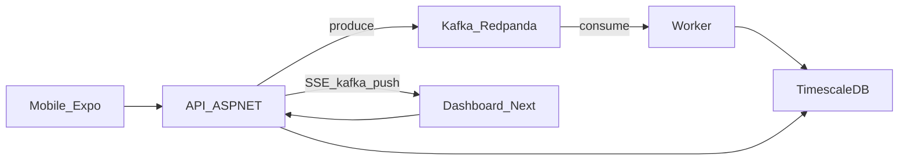

# Fleet Telemetry Platform

[](https://github.com/AlejoLobo/fleet-telemetry-platform/actions/workflows/ci.yml)

Plataforma de monitoreo de flotas con telemetría en tiempo real: ingesta HTTP, pipeline event-driven (Kafka), persistencia en TimescaleDB, dashboard Next.js, app móvil offline-first y agente IA operativo.

## Resumen

Conductores (mobile) o simuladores envían telemetría → la API publica en Kafka → el Worker persiste en TimescaleDB, genera alertas e idempotencia → el dashboard consume API/SSE. MVP vertical completo, defendible en demo y sustentación.

| Capa | Tecnología |
|------|------------|
| API / Worker | .NET 10, ASP.NET Core, Clean Architecture |
| Eventos | Kafka (Redpanda local) |
| Persistencia | TimescaleDB (PostgreSQL + hypertable) |
| Dashboard | Next.js 15 + React 19 |
| Mobile | Expo 52, SQLite offline-first |
| Infra | Docker Compose + Terraform blueprint AWS |

## Arquitectura



Flujo principal: `POST /api/telemetry` → `telemetry.raw` → Worker (`TelemetryMessageProcessor`) → `telemetry_events` / `fleet_alerts` / `processed_events`. Detalle en [docs/architecture.md](docs/architecture.md).

## Quickstart

```bash
# Stack completo (Redpanda + TimescaleDB + API + Worker + Web)
docker compose --profile app up -d --build

# Smoke test E2E (API → Kafka → Worker → DB + DLQ)
./scripts/smoke-test.ps1          # Windows
bash scripts/smoke-test.sh        # Bash
```

| Servicio | URL |
|----------|-----|
| API | http://localhost:5000 |
| Dashboard | http://localhost:3000 |
| Kafka (externo) | `localhost:19092` |
| TimescaleDB | `localhost:5432` (user/pass/db: `fleet`) |

Solo infra (API/Worker/Web en host): `docker compose up -d`. Guía completa: [docs/getting-started.md](docs/getting-started.md).

## Endpoints clave

| Método | Ruta | Descripción |
|--------|------|-------------|
| `GET` | `/health/live` | Liveness |
| `GET` | `/health/ready` | Readiness (DB + Kafka) |
| `GET` | `/api/ops/summary` | Resumen operativo |
| `POST` | `/api/telemetry` | Ingesta → Kafka (`202`) |
| `GET` | `/api/fleet` | Estado de flota (paginado por cursor) |
| `GET` | `/api/alerts` | Alertas abiertas |
| `GET` | `/api/events/stream` | SSE |
| `POST` | `/api/ai/query` | Agente IA |

Lista completa y ejemplos: [docs/api-and-ops.md](docs/api-and-ops.md).

Ver [docs/demo-sustentacion.md](docs/demo-sustentacion.md) para el guion de evaluación y checklist contra requerimientos.

## Documentación

| Guía | Contenido |
|------|-----------|
| [docs/README.md](docs/README.md) | Índice |
| [docs/demo-sustentacion.md](docs/demo-sustentacion.md) | Guion de demo y checklist |
| [docs/architecture.md](docs/architecture.md) | Clean Architecture, DI, flujo |
| [docs/getting-started.md](docs/getting-started.md) | Arranque local, env, caveats |
| [docs/api-and-ops.md](docs/api-and-ops.md) | Endpoints, auth, health/ops |
| [docs/worker-and-dlq.md](docs/worker-and-dlq.md) | Processor, validación, DLQ |
| [docs/testing.md](docs/testing.md) | Unitarios, integración, smoke, CI |
| [docs/database-migrations.md](docs/database-migrations.md) | DDL, `schema_versions`, EF migrations |
| [docs/realtime-sse.md](docs/realtime-sse.md) | SSE por polling (decisión MVP) |
| [infra/README.md](infra/README.md) | Terraform blueprint AWS |
| [web/README.md](web/README.md) / [mobile/README.md](mobile/README.md) | Frontend y app |

## Estructura del repositorio

```
fleet-telemetry-platform/
├── backend/
│   ├── FleetTelemetry.sln
│   ├── FleetTelemetry.Api/
│   ├── FleetTelemetry.Worker/
│   ├── FleetTelemetry.Domain/
│   ├── FleetTelemetry.Application/
│   ├── FleetTelemetry.Infrastructure/
│   ├── FleetTelemetry.Application.Tests/
│   ├── FleetTelemetry.Worker.Tests/
│   └── FleetTelemetry.Integration.Tests/
├── web/                 # Dashboard Next.js
├── mobile/              # Expo offline-first
├── scripts/             # smoke-test.ps1 / smoke-test.sh
├── load-tests/          # k6
├── infra/terraform/     # Blueprint AWS
├── docs/
├── docker-compose.yml
└── .env.example
```

## Diseño del consumidor Kafka

El Worker implementa at-least-once con commit manual, DLQ obligatoria y processor stateless:

- **Mismo offset hasta resultado terminal:** reintentos de negocio y backoff sobre el mismo `ConsumeResult`; el commit solo ocurre tras éxito, duplicado tratado o publicación DLQ exitosa.
- **Coordinación DLQ:** `TelemetryMessageCoordinator` separa procesamiento y publicación; los fallos de DLQ reintentan solo la publicación sin reprocesar el evento.
- **Payloads inválidos:** null, vacío o whitespace → DLQ `invalid_payload`, luego commit.

Detalle: [docs/worker-and-dlq.md](docs/worker-and-dlq.md) · Pruebas: `FleetTelemetry.Worker.Tests`, `FleetTelemetry.Integration.Tests`.

## Matriz de production readiness

| Área | Implementado y probado | Limitación consciente | Blueprint / mock | Pendiente |
|------|------------------------|----------------------|------------------|-----------|
| Ingesta HTTP → Kafka | Sí (smoke + integración) | At-least-once, sin exactly-once E2E | — | Rate limit por API key |
| Worker + DLQ | Sí (unit + integración) | Consumo serial por partición | — | Parallel consumer tuning |
| TimescaleDB local | Sí (Docker Compose + tests) | DDL auto solo Development | RDS PG16 sin Timescale | Timescale Cloud en AWS |
| Dashboard Next.js | Sí (build + mock mode) | SSE por polling DB | — | Hosting productivo |
| Mobile offline | Sí (typecheck + SQLite) | Sin tiendas / EAS manual | — | Sync conflict resolution |
| Agente IA | Sí (tools + mock) | OpenAI opcional | Druid mock (`IAnalyticsQueryService`) | Druid real |
| Seguridad API | Sí (JWT opcional, rate limit, CORS) | Auth parcial en MVP | — | OAuth2 / mTLS |
| Observabilidad | Sí (OTLP opt-in, métricas básicas) | Sin collector en Compose | — | Dashboards Grafana/Tempo |
| CI/CD | Sí (develop + main, fmt/validate) | Sin deploy automático | Terraform blueprint | MSK, ALB, ECS services |
| Migraciones DB | Sí (`schema_versions`, guard prod) | EF migrations no generadas aún | `docs/database-migrations.md` | Pipeline SQL versionado |

Detalle de limitaciones históricas: sección siguiente y [docs/demo-sustentacion.md](docs/demo-sustentacion.md).

## Limitaciones MVP (conscientes)

- Terraform es **blueprint** (RDS = PostgreSQL estándar, sin MSK, ALB completo, tasks productivas ni deploy del dashboard). Persistencia Timescale en AWS: **Timescale Cloud o self-hosted**. Ver [infra/README.md](infra/README.md).
- Analytics Druid: **no desplegado**; solo contrato `IAnalyticsQueryService` con implementación Timescale. Ver [docs/analytics-druid-mock.md](docs/analytics-druid-mock.md).
- SSE **KafkaPush** por defecto (`vehicle-update` canónico). Fan-out multi-réplica, offset Kafka como ID SSE, `Last-Event-ID` y `stream-reset`. Ver [docs/realtime-sse.md](docs/realtime-sse.md).
- JWT opcional y parcial; OpenAI opcional (pulido de texto).
- Preview mobile EAS manual (`mobile-preview.yml`), sin tiendas.
- OpenTelemetry **opt-in** vía `OpenTelemetry:Enabled` y endpoint OTLP configurable.
- DDL automático **deshabilitado en producción**; ver [docs/database-migrations.md](docs/database-migrations.md).
- Worker serial: un mensaje bloqueado puede detener particiones asignadas a la instancia.
- Kafka es **at-least-once**, no exactly-once end-to-end.

## Commits

Mensajes en **español**, conventional commits:

```
tipo(alcance): descripción breve en imperativo
```

Ejemplos: `feat(worker): ...`, `fix(ci): ...`, `docs(readme): ...`, `test(e2e): ...`.

## Auditoría de IA y criterio arquitectónico

Esta sección documenta **propuestas históricas deficientes** surgidas durante el desarrollo
(asistencia automatizada o diseño preliminar) y el **criterio técnico** con el que se
corregieron. **No** describe defectos actuales del código en `develop`: cada caso ya tiene
corrección fusionada, archivos concretos, pruebas y SHA verificable.

### Caso 1: reintento Kafka sin reutilizar el mismo offset

- **Propuesta deficiente:** Tras un `RetryWithoutCommit`, no confirmar el offset, hacer
  `Task.Delay` y volver a llamar a `Consume()` para obtener un mensaje nuevo, en lugar de
  seguir trabajando el mismo `ConsumeResult`.
- **Riesgo:** No hacer commit **no** reposiciona automáticamente el cursor local del
  consumidor. Se puede procesar el mensaje N+1 antes de resolver N; si luego se confirma un
  offset posterior, se produce **pérdida silenciosa** de N. Eso viola la semántica
  **at-least-once** esperada en el Worker.
- **Criterio aplicado y corrección:** Conservar el mismo `ConsumeResult` y **no** llamar de
  nuevo a `Consume()` hasta un resultado terminal. Aplicar backoff configurable
  (`RetryInitialDelayMilliseconds` / `RetryMaxDelayMilliseconds`) sobre el mismo offset.
  Confirmar únicamente tras éxito, duplicado o DLQ publicada correctamente.
- **Archivos:**
  `backend/FleetTelemetry.Worker/TelemetryConsumerWorker.cs`,
  `backend/FleetTelemetry.Worker/TelemetryMessageProcessor.cs`,
  `backend/FleetTelemetry.Worker/KafkaProcessingRetryBackoff.cs`,
  `backend/FleetTelemetry.Infrastructure/Configuration/KafkaOptions.cs`,
  `backend/FleetTelemetry.Infrastructure/Configuration/ConfigurationValidator.cs`,
  `backend/FleetTelemetry.Worker/appsettings.json`,
  `.env.example`
- **Pruebas:**
  `backend/FleetTelemetry.Worker.Tests/KafkaProcessingRetryBackoffTests.cs`,
  `TelemetryMessageProcessorTests.Transient_db_error_sigue_reintentando`,
  integración
  `TelemetryConsumerWorkerIntegrationTests.Failed_first_offset_is_retried_before_second_offset_is_processed`
  (el primer offset falla y se procesa antes que el segundo)
- **Commit:** `e557210ad9aa526d622ba678fe4ec9464487d253` —
  `fix(worker): garantizar at-least-once reintentando el mismo offset`

### Caso 2: excepciones desconocidas enviadas a DLQ

- **Propuesta deficiente:** Capturar cualquier `Exception` restante, publicarla en DLQ como
  `processing_failure` y confirmar el offset, tratando `NullReferenceException`, errores de
  mapping o defectos de programación como problemas permanentes del mensaje.
- **Riesgo:** Ocultar errores sistémicos, confirmar el offset y perder la oportunidad de
  reprocesar tras corregir el software. Convierte un defecto de código en un falso problema
  de datos.
- **Criterio aplicado y corrección:** Taxonomía explícita en el Worker: datos o contrato
  inválido → DLQ; fallo transitorio reconocido → retry sin commit; excepción desconocida →
  `LogCritical`, `StopApplication`, **sin** DLQ y **sin** commit.
- **Archivos:**
  `backend/FleetTelemetry.Worker/TelemetryMessageCoordinator.cs`,
  `backend/FleetTelemetry.Worker/TelemetryMessageProcessor.cs`,
  `docs/worker-and-dlq.md`
- **Pruebas:**
  `TelemetryMessageCoordinatorTests.Excepcion_inesperada_detiene_worker_sin_commit`
  (no publica DLQ, no confirma offset, solicita detener el Worker),
  `TelemetryMessageCoordinatorTests.Excepcion_inesperada_no_se_reintenta`,
  `TelemetryMessageProcessorTests.Excepcion_inesperada_se_propaga_sin_crear_DLQ`,
  integración
  `TelemetryConsumerWorkerIntegrationTests.Unexpected_error_stops_without_dlq_or_commit`
- **Commit:** `fc5f37368769f15026bd68bac366583958199f4c` —
  `fix(worker): detener procesamiento ante errores inesperados`
  (merge relacionado: `4cbb8bdcfa17ff09a674fce9235a9d7895c4fbe2`)

### Caso 3: Terraform aparentaba ser desplegable

- **Propuesta deficiente:** Presentar RDS PostgreSQL estándar, task definitions incompletas y
  placeholders `REPLACE_WITH_` como ruta desplegable de TimescaleDB/Kafka, describiendo
  definiciones sin services ni ALB como si fueran un despliegue funcional.
- **Riesgo:** Infraestructura engañosa: un `terraform apply` del blueprint no entrega un
  stack end-to-end; no hay TimescaleDB real ni una ruta reproducible de ejecución del MVP.
- **Criterio aplicado y corrección:** Conservar el blueprint conceptual claramente separado;
  agregar entorno **dev** ejecutable en `infra/terraform/dev/` (VPC, EC2 + Docker Compose,
  Redpanda, TimescaleDB, API, Worker, Web, ALB, Secrets Manager, IAM y SSM). Eliminar
  `REPLACE_WITH_` y las task definitions incompletas del árbol desplegable.
- **Archivos:**
  `infra/terraform/dev/` (`network.tf`, `alb.tf`, `compute.tf`, `security.tf`, `secrets.tf`,
  `variables.tf`, `user-data.sh.tftpl`, `terraform.tfvars.example`, `README.md`),
  `infra/README.md`,
  `docker-compose.yml`,
  `.github/workflows/ci.yml` (job Infra validation: `terraform fmt`/`validate` y rechazo de
  placeholders/secretos)
- **Pruebas:** Validación local y CI de Terraform (`fmt -check`, `init -backend=false`,
  `validate` en blueprint y `dev`); `git grep "REPLACE_WITH_"` vacío en `infra/terraform`;
  `docker compose config --quiet`. Run aprobado:
  https://github.com/AlejoLobo/fleet-telemetry-platform/actions/runs/29363945100
- **Commit:** `ba74a436f9c8a9d6bc9bda55eae970a554e4b850` —
  `fix(infra): añadir entorno dev reproducible en AWS`
  (merge en `develop`: `949be8e3086e35bbbaab52f9b3cbcaf2f7a5dd12`)
