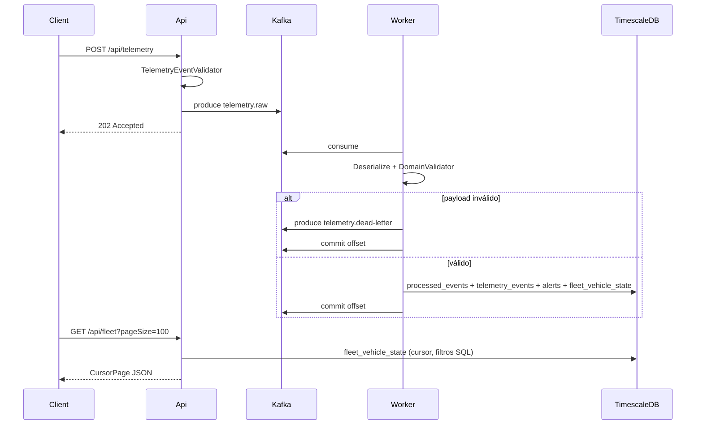

# Arquitectura

## Clean Architecture

| Proyecto | Responsabilidad |
|----------|-----------------|
| `FleetTelemetry.Domain` | Entidades (`TelemetryEvent`, `FleetAlert`) |
| `FleetTelemetry.Application` | Casos de uso, DTOs, validadores, interfaces |
| `FleetTelemetry.Infrastructure` | Kafka, TimescaleDB, resiliencia, SSE broker, OpenAI |
| `FleetTelemetry.Api` | HTTP: ingesta, consultas, health, ops, SSE, IA |
| `FleetTelemetry.Worker` | Consumidor Kafka + `TelemetryMessageProcessor` |

**Una sola API** y **un solo Worker**. No hay segundo servicio de ingesta.

## Flujo de telemetría

## Decisiones clave

- **Ingesta desacoplada:** el controller/use case de API **no** persiste; solo publica en Kafka.
- **DI por perfil:** `InfrastructureProfile.Api` vs `Worker` en `DependencyInjection.cs`.
- **Idempotencia:** `processed_events` con `ON CONFLICT DO NOTHING` en la misma transacción que telemetría y alertas.
- **Validación en dos capas:**
  - API: `TelemetryEventValidator` (DTO `TelemetryEventRequest`).
  - Worker: `TelemetryDomainEventValidator` (entidad tras deserializar JSON de Kafka).
- **SSE:** modo **KafkaPush** por defecto (`fleet.realtime` → API → SSE). Fan-out multi-réplica con **Assign manual** por réplica (sin rebalance de grupo); offset Kafka como `id` SSE; replay local acotado y `stream-reset` ante gaps. Modo alternativo: polling a TimescaleDB. Ver [realtime-sse.md](realtime-sse.md).
- **Expiración de conectividad:** `FleetConnectivityExpiryHostedService` en el Worker publica `offline` sin telemetría nueva.
- **Resiliencia:** circuit breaker + retry en Kafka produce, DB (solo transitorios vía `DatabaseTransientFailureClassifier`) y OpenAI. Estado en `GET /health`.
- **Read model de flota:** `fleet_vehicle_state` (1 fila/vehículo), actualizado en la misma transacción del Worker con UPSERT protegido ante eventos fuera de orden. Consultas `GET /api/fleet` paginadas por cursor sobre esta tabla (no `DISTINCT ON` global).
- **Historial paginado:** `GET /api/telemetry/{vehicleId}` usa keyset (`Timestamp DESC`, `EventId DESC`) con límite superior estable en el cursor.

## Alertas (Worker)

| Tipo | Condición | Severidad |
|------|-----------|-----------|
| `overspeed` | `speedKmh` > 120 | critical |
| `low_fuel` | `fuelLevelPercent` < 15 | warning |
| `low_battery` | `batteryPercent` < 20 | warning |

### Estado activo y cooldown (FT-006)

La tabla `fleet_alert_states` mantiene una fila por `(VehicleId, AlertType)` y representa las condiciones del **último evento aceptado** por `fleet_vehicle_state` (mismo criterio de orden: `Timestamp` más reciente; empate → `EventId` mayor).

| Campo | Rol |
|-------|-----|
| `IsActive` | Condición técnica incumplida (independiente de `IsAcknowledged`) |
| `LastConditionAt` | Última telemetría que observó el incumplimiento |
| `LastAlertAt` | Última `FleetAlert` emitida (nullable) |

Observaciones tri-estado (`NotObserved` / `Recovered` / `Breached`):

- `overspeed`: siempre observado (`SpeedKmh` obligatorio).
- `low_fuel` / `low_battery`: `null` → `NotObserved` (no recupera, no recuerda, no crea estado).
- valor bajo umbral → `Breached`; valor en rango → `Recovered`.

Política (`Alerting:CooldownSeconds`, default 300):

1. `NotObserved` → sin cambios de estado.
2. Inactiva + `Recovered` → sin cambios.
3. Inactiva + `Breached` (sin `LastAlertAt` o cooldown vencido) → `IsActive=true` + una `FleetAlert`.
4. Activa + `Breached` dentro del cooldown → solo `LastConditionAt`.
5. Activa + `Breached` con cooldown vencido → una alerta recordatoria + `LastAlertAt`.
6. Activa + `Recovered` → `IsActive=false` (no toca acknowledgement).
7. Tras recuperación, nueva `Breached` dentro del cooldown → reactiva sin emitir (anti-oscilación).
8. Reconocer una alerta no cierra la condición activa.

Orden en la misma transacción: `processed_events` → `telemetry_events` → UPSERT `fleet_vehicle_state` → solo si hubo filas afectadas: `SELECT … FOR UPDATE` de estados, evaluación, UPSERT `fleet_alert_states` e insert de alertas emitidas. Si el evento queda fuera de orden, se conservan historial/idempotencia y no se publican vehicle-update ni alertas. Concurrencia: `pg_advisory_xact_lock(hashtext(VehicleId))`.

## Tópicos Kafka

| Tópico | Uso |
|--------|-----|
| `telemetry.raw` | Ingesta (legacy plano o envelope V1 según `Kafka:UseEventEnvelope`) |
| `telemetry.dead-letter` | DLQ |

Contrato versionado V1: [kafka-telemetry-contract.md](kafka-telemetry-contract.md).

Detalle de procesamiento y DLQ: [worker-and-dlq.md](worker-and-dlq.md).
