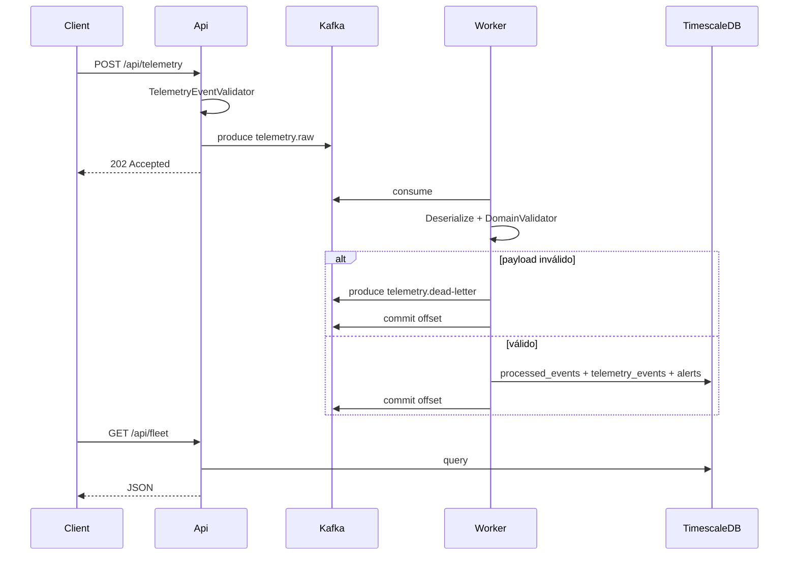

# Arquitectura

## Clean Architecture

| Proyecto | Responsabilidad |
|----------|-----------------|
| `FleetTelemetry.Domain` | Entidades (`TelemetryEvent`, `FleetAlert`) |
| `FleetTelemetry.Application` | Casos de uso, DTOs, validadores, interfaces |
| `FleetTelemetry.Infrastructure` | Kafka, TimescaleDB, resiliencia, SSE broker, OpenAI |
| `FleetTelemetry.Api` | HTTP: ingesta, consultas, health, ops, SSE, IA |
| `FleetTelemetry.Worker` | Consumidor Kafka + `TelemetryMessageProcessor` |

**Una sola API** y **un solo Worker**. No hay segundo servicio de ingesta.

## Flujo de telemetría

## Decisiones clave

- **Ingesta desacoplada:** el controller/use case de API **no** persiste; solo publica en Kafka.
- **DI por perfil:** `InfrastructureProfile.Api` vs `Worker` en `DependencyInjection.cs`.
- **Idempotencia:** `processed_events` con `ON CONFLICT DO NOTHING` en la misma transacción que telemetría y alertas.
- **Validación en dos capas:**
  - API: `TelemetryEventValidator` (DTO `TelemetryEventRequest`).
  - Worker: `TelemetryDomainEventValidator` (entidad tras deserializar JSON de Kafka).
- **SSE:** polling a TimescaleDB (`FleetSsePollerHostedService`), no push desde Kafka. Ver [realtime-sse.md](realtime-sse.md).
- **Resiliencia:** circuit breaker + retry en Kafka produce, DB (solo transitorios vía `DatabaseTransientFailureClassifier`) y OpenAI. Estado en `GET /health`.
- **Kafka at-least-once:** mismo `ConsumeResult` hasta terminal; sin exactly-once end-to-end; orden solo por partición; Worker serial.

## Alertas (Worker)

| Tipo | Condición | Severidad |
|------|-----------|-----------|
| `overspeed` | `speedKmh` > 120 | critical |
| `low_fuel` | `fuelLevelPercent` < 15 | warning |
| `low_battery` | `batteryPercent` < 20 | warning |

## Tópicos Kafka

| Tópico | Uso |
|--------|-----|
| `telemetry.raw` | Ingesta (legacy plano o envelope V1 según `Kafka:UseEventEnvelope`) |
| `telemetry.dead-letter` | DLQ |

Contrato versionado V1: [kafka-telemetry-contract.md](kafka-telemetry-contract.md).

Detalle de procesamiento y DLQ: [worker-and-dlq.md](worker-and-dlq.md).
