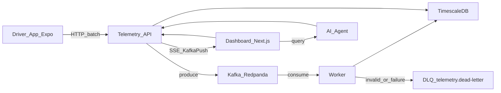

# Demo de sustentación — Fleet Telemetry Platform

Guion ejecutivo para evaluación técnica senior. Detalle operativo en [architecture.md](architecture.md), [worker-and-dlq.md](worker-and-dlq.md) y [api-and-ops.md](api-and-ops.md).

## 1. Resumen de la solución

La plataforma ingiere telemetría de conductores (Expo offline-first) o clientes HTTP hacia una API .NET event-driven. La API valida y publica en Kafka/Redpanda (`telemetry.raw`); un Worker consume, valida dominio, persiste de forma transaccional e idempotente en TimescaleDB y genera alertas. Fallos no recuperables van a DLQ (`telemetry.dead-letter`).

El dashboard Next.js consulta la API y recibe actualizaciones por SSE en modo **KafkaPush** (predeterminado; Polling es alternativo). Un agente IA operativo responde consultas de flota/alertas (`POST /api/ai/query`), con OpenAI opcional detrás de circuit breaker. El stack local se levanta con Docker Compose; hay smoke E2E, k6, CI, blueprint Terraform AWS y un entorno **dev ejecutable** en `infra/terraform/dev`. OpenTelemetry OTLP está implementado como **opt-in**.

## 2. Arquitectura end-to-end



## 3. Flujo principal de telemetría

1. Cliente envía `POST /api/telemetry` (o batch desde mobile).
2. API valida payload y produce a `telemetry.raw` → `202 Accepted`.
3. Worker (`TelemetryConsumerWorker` + `TelemetryMessageProcessor`) consume el mensaje.
4. Validación de dominio Kafka; si falla → DLQ `invalid_payload`.
5. Persistencia transaccional: evento + alertas + marca de idempotencia por `EventId` (`processed_events`).
6. Duplicados se detectan y se confirman sin reprocesar.
7. TimescaleDB alimenta flota/alertas; el dashboard las muestra vía REST + SSE.
8. Errores de procesamiento no transitorios → DLQ `processing_failure`; offset solo se confirma si el camino (éxito o DLQ) es seguro.

## 4. Resiliencia y calidad

| Mecanismo | Rol |
|-----------|-----|
| Circuit breakers (Polly) | Kafka produce, TimescaleDB, OpenAI; estado en `/health` y `/health/circuit-breakers` |
| Retry + backoff | Fallos transitorios de DB/Kafka; sin DLQ ni commit prematuro |
| DLQ `telemetry.dead-letter` | Payloads inválidos y fallos de procesamiento no recuperables |
| Commit manual de offset | Solo tras éxito o DLQ exitoso; reintento del **mismo** offset (at-least-once) |
| Validación Kafka | `TelemetryDomainEventValidator` en Worker (además del validador de API) |
| Health checks | `/health/live`, `/health/ready` (DB + Kafka) |
| Smoke E2E | `scripts/smoke-test.*`: API → Kafka → Worker → DB + DLQ |
| Tests / CI | Application + Worker + Integration; Web Vitest (`test:ci` + cobertura); Mobile Jest (`test:ci` + cobertura) |

## 5. Comandos de demo

```bash
# Stack completo
docker compose --profile app up -d --build

# Smoke E2E
./scripts/smoke-test.ps1          # Windows
bash scripts/smoke-test.sh        # Bash

# Health y ops
curl http://localhost:5000/health/live
curl http://localhost:5000/health/ready
curl http://localhost:5000/api/ops/summary
```

URLs: API `http://localhost:5000` · Dashboard `http://localhost:3000`.

## 6. Checklist contra requerimientos

| Requerimiento | Implementación | Estado |
|---------------|----------------|--------|
| Backend event-driven | API produce + Worker consume; Clean Architecture .NET 10 | Cumple |
| Kafka/RabbitMQ | Kafka vía Redpanda local; at-least-once + tests reales | Cumple |
| TimescaleDB/Druid | TimescaleDB hypertable; Druid no desplegado (contrato intercambiable) | Cumple parcialmente |
| Circuit breakers | Polly en Kafka, DB y OpenAI; solo fallos transitorios de DB | Cumple |
| Agente IA | `POST /api/ai/query` + pulido OpenAI opcional | Cumple |
| SPA reactiva | Dashboard Next.js 15 | Cumple |
| WebSockets/SSE | KafkaPush predeterminado; Polling alternativo; replay acotado, Last-Event-ID, stream-reset, resync por snapshot; multi-réplica según limitaciones documentadas | Cumple |
| Mobile offline-first | Expo 52 + cola local | Cumple |
| SQLite | `expo-sqlite` en mobile | Cumple |
| Batch sync | `POST /api/telemetry/batch` | Cumple |
| Pruebas Web/Mobile | CI ejecuta Vitest (`npm run test:ci --prefix web`) y Jest (`npm run test:ci` en mobile) con cobertura | Cumple |
| k6/JMeter | `load-tests/` (k6) | Cumple |
| Docker Compose | Infra + profile `app` | Cumple |
| Terraform/AWS | Blueprint conceptual en `infra/terraform/` + entorno **dev ejecutable** en `infra/terraform/dev` (EC2 + Docker Compose, ALB, Secrets Manager, IAM, SSM); no es HA productivo | Cumple parcialmente |
| Documentación DLQ/Kafka | [worker-and-dlq.md](worker-and-dlq.md) + pruebas de offsets e idempotencia | Cumple |
| Auditoría de IA | Casos verificables en README con riesgo, corrección, archivos, pruebas y commits | Cumple |
| OpenTelemetry | Implementado opt-in; exporta OTLP (trazas, métricas y logs); sin collector ni dashboards en Compose | Cumple parcialmente |

## 7. Limitaciones conscientes

- Terraform incluye blueprint conceptual y entorno **dev ejecutable** (`infra/terraform/dev`), pero **no** es un despliegue productivo de alta disponibilidad (sin multi-AZ de datos, TLS/WAF, autoscaling ni servicios gestionados MSK/ECS).
- Druid real no está desplegado; se usa un contrato intercambiable con implementación Timescale.
- Mobile preview es **manual** con EAS (GitHub Actions); no hay publicación en tiendas.
- SSE usa **KafkaPush** por defecto; **Polling** permanece como modo alternativo. Replay, `Last-Event-ID`, `stream-reset` y resync tienen límites documentados (p. ej. fan-out multi-réplica).
- OpenTelemetry está **implementado** y es **opt-in**; Compose no incluye collector, Grafana, Tempo ni Prometheus.
- Auth es **parcial** para MVP (`AuthorizeWhenEnabled`; JWT opcional).

## 8. Próximos pasos productivos

- MSK o Kafka gestionado en AWS.
- ALB + ECS services reales para API/Worker.
- Secrets Manager (connection strings, API keys, JWT) en rutas productivas.
- Observabilidad: añadir collector, Grafana, Tempo y Prometheus (u otra plataforma) sobre el export OTLP existente.
- Pipeline de release mobile formal (store / distribución interna versionada).
